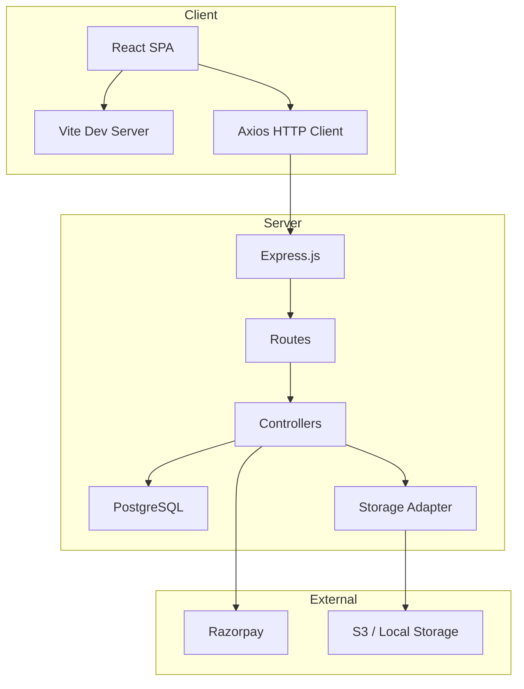
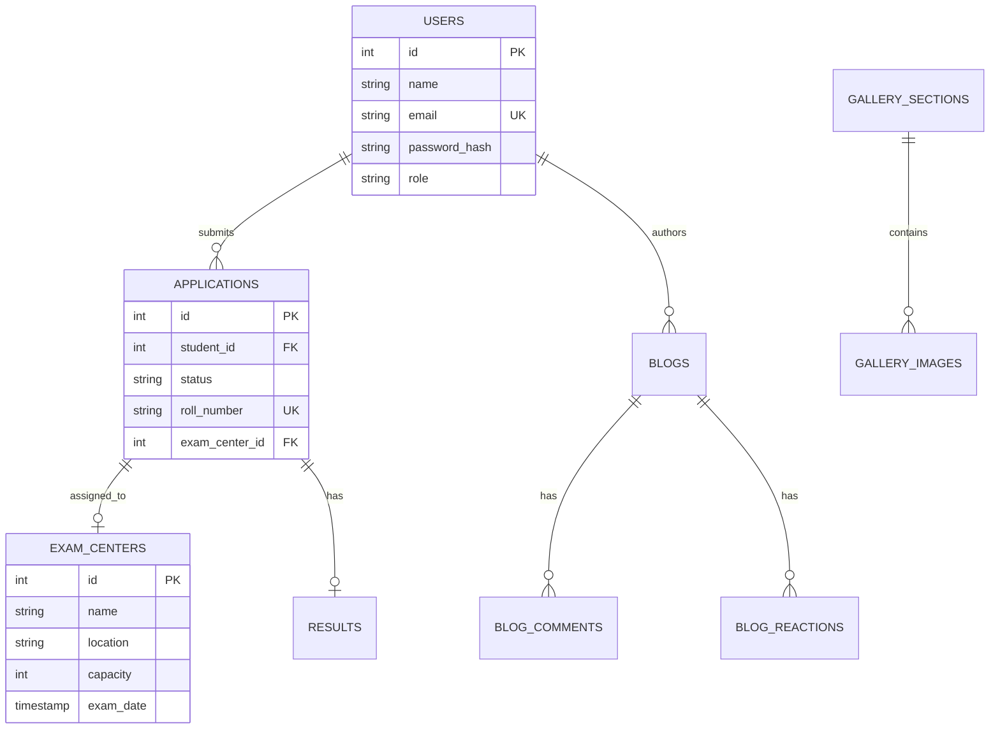

# Fifty Villagers - Code Review & Deployment Guide

> **Generated:** December 6, 2025  
> **Version:** 1.0.0

---

## Table of Contents

1. [Executive Summary](#executive-summary)
2. [Architecture Overview](#architecture-overview)
3. [Code Quality Analysis](#code-quality-analysis)
4. [Security Audit](#security-audit)
5. [Database Schema](#database-schema)
6. [API Documentation](#api-documentation)
7. [Docker Configuration](#docker-configuration)
8. [Deployment Guide](#deployment-guide)
9. [Cloudflare Setup](#cloudflare-setup)
10. [Production Checklist](#production-checklist)

---

## Executive Summary

**Fifty Villagers** is a MERN-stack education portal for scholarship applications, featuring:

- **Student Portal**: Registration, application submission, payment, admit card download
- **Admin Dashboard**: Application management, blog/gallery CMS, success stories
- **Public Site**: Home, blogs, gallery, success stories

### Tech Stack

| Layer | Technology |
|-------|------------|
| Frontend | React 18 + Vite + Tailwind CSS |
| Backend | Express 5 + Node.js |
| Database | PostgreSQL |
| Auth | JWT (5-day expiry) |
| Payments | Razorpay |
| File Storage | Local (S3-ready adapter) |
| Logging | Winston |

---

## Architecture Overview



### Directory Structure

```
├── client/                 # React Frontend
│   ├── src/
│   │   ├── components/     # Reusable UI components
│   │   ├── pages/          # Route pages (public/student/admin)
│   │   ├── layouts/        # Layout wrappers
│   │   └── context/        # React Context (Auth)
│   └── dist/               # Production build
│
├── server/                 # Express Backend
│   ├── config/             # DB, Logger, Env validation
│   ├── controllers/        # Business logic (7 files)
│   ├── middleware/         # Auth, Upload, Error handling
│   ├── routes/             # API endpoints (8 files)
│   ├── migrations/         # SQL schema
│   ├── storage/            # File upload adapter
│   └── utils/              # Migration runner
```

---

## Code Quality Analysis

### Strengths ✅

| Area | Details |
|------|---------|
| **Modern Stack** | Express 5, React 18, ES Modules |
| **Security** | Helmet, CORS, Rate Limiting, Input Validation |
| **Logging** | Winston with structured JSON logs |
| **Error Handling** | Centralized error middleware |
| **File Uploads** | Sanitized filenames, MIME validation |
| **Storage** | Pluggable adapter (local/S3) |
| **Pagination** | Implemented on all list endpoints |

### Areas for Improvement ⚠️

| Issue | Severity | Recommendation |
|-------|----------|----------------|
| No automated tests | Medium | Add Jest/Vitest test suites |
| Console.log in production | Low | Remove or replace with logger |
| No API versioning | Low | Consider `/api/v1/` prefix |
| No refresh tokens | Medium | Implement token refresh flow |
| Missing TypeScript | Low | Consider migration for type safety |

---

## Security Audit

### Implemented ✅

- [x] **Helmet** - Security headers enabled
- [x] **CORS** - Restricted to FRONTEND_ORIGIN
- [x] **Rate Limiting** - 300 req/15min global, 20/15min for auth
- [x] **Input Validation** - express-validator on auth routes
- [x] **Password Hashing** - bcrypt with salt rounds
- [x] **JWT Auth** - Secure token-based authentication
- [x] **File Upload Validation** - MIME type + extension checks
- [x] **Filename Sanitization** - sanitize-filename library

### Recommendations 📋

1. **Add Magic Byte Validation**
   ```javascript
   const { fileTypeFromBuffer } = require('file-type');
   const buffer = fs.readFileSync(file.path);
   const type = await fileTypeFromBuffer(buffer);
   if (!type || !['image/jpeg', 'image/png'].includes(type.mime)) {
       throw new Error('Invalid file type');
   }
   ```

2. **Implement HTTPS Only**
   ```javascript
   app.use((req, res, next) => {
       if (req.headers['x-forwarded-proto'] !== 'https') {
           return res.redirect(`https://${req.headers.host}${req.url}`);
       }
       next();
   });
   ```

3. **Add CSP Headers**
   ```javascript
   app.use(helmet.contentSecurityPolicy({
       directives: {
           defaultSrc: ["'self'"],
           scriptSrc: ["'self'", "'unsafe-inline'"],
           styleSrc: ["'self'", "'unsafe-inline'", "fonts.googleapis.com"],
       }
   }));
   ```

---

## Database Schema

### Entity Relationship Diagram



### Tables Summary

| Table | Purpose | Records |
|-------|---------|---------|
| `users` | Student/Admin accounts | - |
| `applications` | Scholarship applications | - |
| `exam_centers` | Physical exam locations | 1 (seeded) |
| `results` | Exam scores & rankings | - |
| `blogs` | CMS blog posts | - |
| `gallery_sections` | Photo gallery categories | - |
| `success_stories` | Alumni testimonials | - |

---

## API Documentation

See [API_USAGE.md](file:///d:/Fify%20Villagers/server/API_USAGE.md) for detailed endpoint documentation.

### Quick Reference

| Method | Endpoint | Auth | Description |
|--------|----------|------|-------------|
| POST | `/api/auth/register` | No | Register student |
| POST | `/api/auth/login` | No | Login |
| GET | `/api/auth/me` | JWT | Get current user |
| GET | `/api/applications/my-application` | JWT | Get student's app |
| POST | `/api/payment/create-order` | JWT | Create Razorpay order |
| GET | `/api/student/stories` | No | List success stories |
| GET | `/api/blogs` | No | List blog posts |
| GET | `/api/gallery` | No | List gallery |

---

## Docker Configuration

### Dockerfile (Server)

Create `server/Dockerfile`:

```dockerfile
FROM node:20-alpine

WORKDIR /app

# Install dependencies
COPY package*.json ./
RUN npm ci --only=production

# Copy source
COPY . .

# Create uploads directory
RUN mkdir -p uploads

# Expose port
EXPOSE 5000

# Health check
HEALTHCHECK --interval=30s --timeout=3s \
    CMD wget --no-verbose --tries=1 --spider http://localhost:5000/health || exit 1

# Start
CMD ["node", "server.js"]
```

### Dockerfile (Client)

Create `client/Dockerfile`:

```dockerfile
FROM node:20-alpine AS builder

WORKDIR /app
COPY package*.json ./
RUN npm ci
COPY . .
RUN npm run build

FROM nginx:alpine
COPY --from=builder /app/dist /usr/share/nginx/html
COPY nginx.conf /etc/nginx/conf.d/default.conf
EXPOSE 80
CMD ["nginx", "-g", "daemon off;"]
```

### docker-compose.yml

Create `docker-compose.yml` at project root:

```yaml
version: '3.8'

services:
  db:
    image: postgres:15-alpine
    environment:
      POSTGRES_DB: fifty_villagers
      POSTGRES_USER: postgres
      POSTGRES_PASSWORD: ${DB_PASSWORD}
    volumes:
      - postgres_data:/var/lib/postgresql/data
      - ./server/migrations:/docker-entrypoint-initdb.d
    healthcheck:
      test: ["CMD-SHELL", "pg_isready -U postgres"]
      interval: 10s
      timeout: 5s
      retries: 5

  server:
    build: ./server
    environment:
      - NODE_ENV=production
      - PORT=5000
      - DB_HOST=db
      - DB_PORT=5432
      - DB_USER=postgres
      - DB_PASSWORD=${DB_PASSWORD}
      - DB_NAME=fifty_villagers
      - JWT_SECRET=${JWT_SECRET}
      - FRONTEND_ORIGIN=${FRONTEND_ORIGIN}
      - BASE_URL=${BASE_URL}
      - RAZORPAY_KEY_ID=${RAZORPAY_KEY_ID}
      - RAZORPAY_KEY_SECRET=${RAZORPAY_KEY_SECRET}
    ports:
      - "5000:5000"
    depends_on:
      db:
        condition: service_healthy
    volumes:
      - uploads:/app/uploads

  client:
    build:
      context: ./client
      args:
        VITE_API_URL: ${VITE_API_URL}
    ports:
      - "80:80"
    depends_on:
      - server

volumes:
  postgres_data:
  uploads:
```

### nginx.conf (Client)

Create `client/nginx.conf`:

```nginx
server {
    listen 80;
    server_name _;
    root /usr/share/nginx/html;
    index index.html;

    # Gzip compression
    gzip on;
    gzip_types text/plain text/css application/json application/javascript;

    # SPA routing
    location / {
        try_files $uri $uri/ /index.html;
    }

    # API proxy
    location /api/ {
        proxy_pass http://server:5000/api/;
        proxy_http_version 1.1;
        proxy_set_header Upgrade $http_upgrade;
        proxy_set_header Connection 'upgrade';
        proxy_set_header Host $host;
        proxy_cache_bypass $http_upgrade;
    }

    # Static file caching
    location ~* \.(js|css|png|jpg|jpeg|gif|ico|svg|woff|woff2)$ {
        expires 30d;
        add_header Cache-Control "public, immutable";
    }
}
```

---

## Deployment Guide

### Prerequisites

- [ ] VPS/Cloud Server (Ubuntu 22.04+ recommended)
- [ ] Domain name configured
- [ ] PostgreSQL 15+ installed (or use Docker)
- [ ] Node.js 20+ installed
- [ ] Nginx installed (for reverse proxy)

### Step 1: Server Setup

```bash
# Update system
sudo apt update && sudo apt upgrade -y

# Install Docker
curl -fsSL https://get.docker.com | sh
sudo usermod -aG docker $USER

# Install Docker Compose
sudo apt install docker-compose-plugin
```

### Step 2: Clone & Configure

```bash
# Clone repository
git clone https://github.com/your-repo/fifty-villagers.git
cd fifty-villagers

# Create production env file
cp server/.env.example server/.env
nano server/.env  # Edit with production values
```

### Step 3: Production Environment Variables

```env
# Server .env
NODE_ENV=production
PORT=5000
BASE_URL=https://api.yoursite.com

# Database
DB_HOST=db
DB_PORT=5432
DB_USER=postgres
DB_PASSWORD=<STRONG_PASSWORD>
DB_NAME=fifty_villagers

# Auth
JWT_SECRET=<64_CHAR_RANDOM_STRING>

# CORS
FRONTEND_ORIGIN=https://yoursite.com

# Storage
STORAGE_DRIVER=local
UPLOAD_DIR=uploads
MAX_UPLOAD_MB=5

# Razorpay (Live Keys)
RAZORPAY_KEY_ID=rzp_live_xxxxx
RAZORPAY_KEY_SECRET=xxxxx
```

### Step 4: Build & Deploy

```bash
# Build and start containers
docker compose up -d --build

# Check logs
docker compose logs -f

# Run migrations (if not auto-run)
docker compose exec server node run_migrations.js
```

### Step 5: SSL with Certbot

```bash
# Install Certbot
sudo apt install certbot python3-certbot-nginx

# Get certificate
sudo certbot --nginx -d yoursite.com -d api.yoursite.com

# Auto-renewal test
sudo certbot renew --dry-run
```

---

## Cloudflare Setup

### DNS Configuration

| Type | Name | Content | Proxy |
|------|------|---------|-------|
| A | @ | YOUR_SERVER_IP | ✅ Proxied |
| A | api | YOUR_SERVER_IP | ✅ Proxied |
| CNAME | www | yoursite.com | ✅ Proxied |

### SSL/TLS Settings

1. Navigate to **SSL/TLS** → **Overview**
2. Set mode to **Full (strict)**
3. Enable **Always Use HTTPS**
4. Enable **Automatic HTTPS Rewrites**

### Page Rules

| URL Pattern | Setting |
|-------------|---------|
| `*yoursite.com/api/*` | Cache Level: Bypass |
| `*yoursite.com/uploads/*` | Cache Level: Standard, Edge TTL: 1 month |
| `*yoursite.com/*` | Browser Integrity Check: On |

### Firewall Rules

1. **Block Tor** (optional): `ip.geoip.is_anonymous_proxy eq true` → Block
2. **Challenge Bots**: `cf.client.bot` → JS Challenge
3. **Rate Limit**: 100 requests per 10 seconds per IP

### Caching

1. **Browser Cache TTL**: 4 hours
2. **Always Online**: Enabled
3. **Development Mode**: Off (for production)

---

## Production Checklist

### Pre-Deployment ✅

- [ ] All environment variables set
- [ ] Database migrations tested
- [ ] Admin password changed from default
- [ ] JWT_SECRET is a strong random string (64+ chars)
- [ ] Razorpay switched to Live keys
- [ ] CORS restricted to production domain
- [ ] Console.log statements removed
- [ ] Error messages don't expose stack traces

### Security ✅

- [ ] HTTPS enforced
- [ ] Helmet headers configured
- [ ] Rate limiting enabled
- [ ] Input validation on all endpoints
- [ ] File upload restrictions in place
- [ ] SQL injection protection (parameterized queries)

### Performance ✅

- [ ] Production build (`npm run build`)
- [ ] Gzip compression enabled
- [ ] Static assets cached (30 days)
- [ ] Database indexes created
- [ ] Images optimized (WebP)

### Monitoring ✅

- [ ] Health endpoint working (`/health`)
- [ ] Error logging to files (Winston)
- [ ] Uptime monitoring (UptimeRobot/Pingdom)
- [ ] Database backups scheduled

### Post-Deployment ✅

- [ ] SSL certificate valid
- [ ] All routes accessible
- [ ] Payment flow tested (test transaction)
- [ ] Email notifications working (if implemented)
- [ ] Mobile responsiveness verified

---

## Maintenance Commands

```bash
# View logs
docker compose logs -f server

# Restart services
docker compose restart

# Database backup
docker compose exec db pg_dump -U postgres fifty_villagers > backup.sql

# Database restore
cat backup.sql | docker compose exec -T db psql -U postgres fifty_villagers

# Update deployment
git pull
docker compose up -d --build

# Clean up
docker system prune -a
```

---

## Support & Resources

- **PostgreSQL Docs**: https://www.postgresql.org/docs/
- **Express.js Guide**: https://expressjs.com/
- **Vite Documentation**: https://vitejs.dev/
- **Cloudflare Docs**: https://developers.cloudflare.com/
- **Docker Compose**: https://docs.docker.com/compose/

---

*Review completed. Project is MVP-ready for deployment.*
